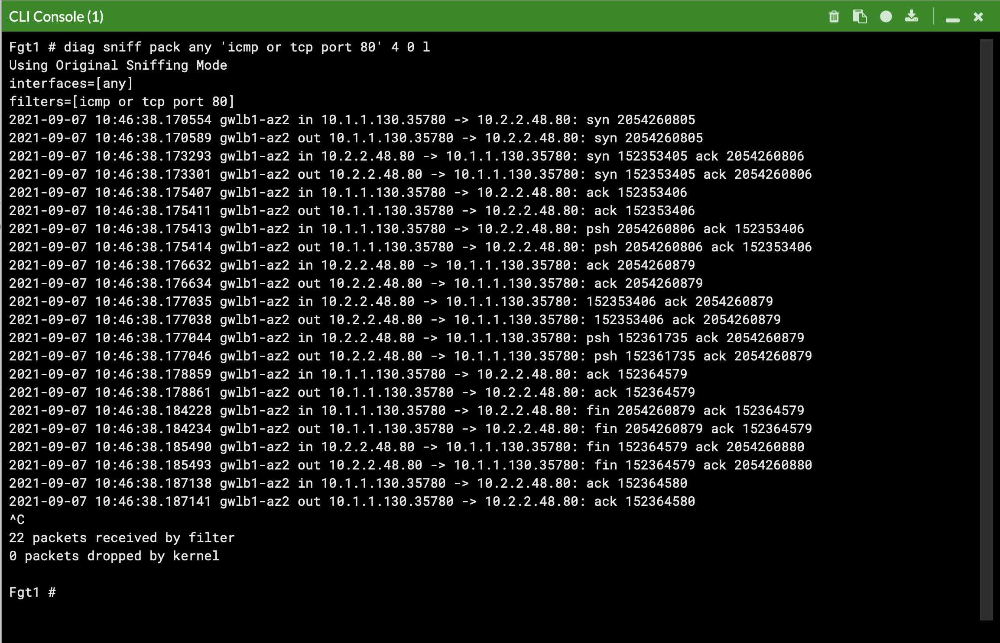
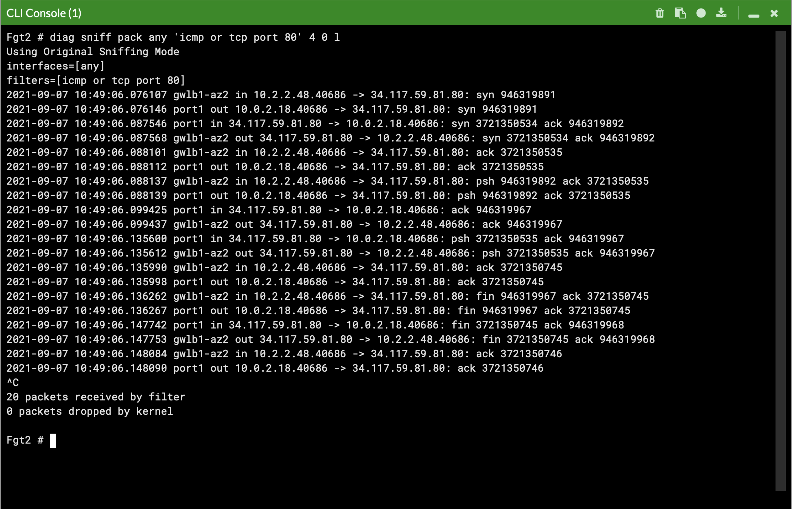
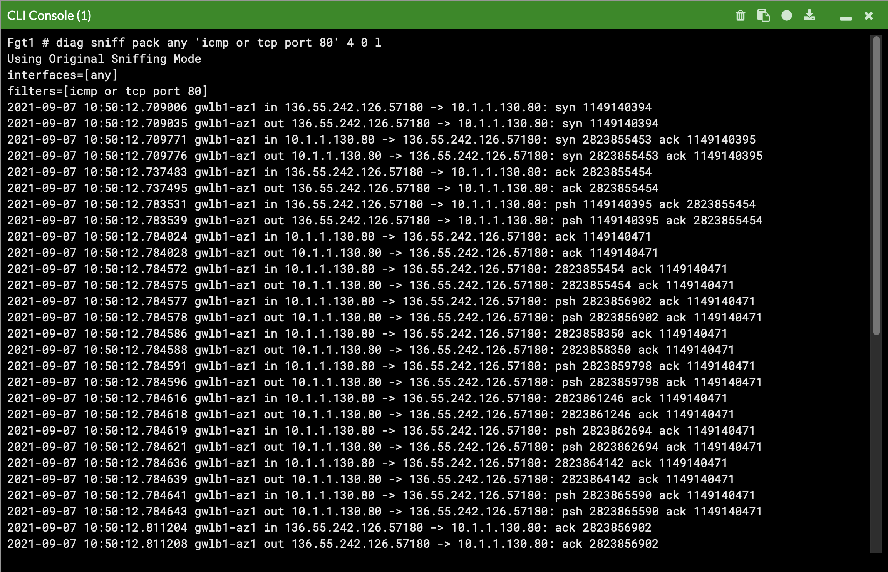

Once the prerequisites have been satisfied proceed with the deployment steps below.

1.  Clone this repo with the command below.
```
git clone https://github.com/FortinetCloudCSE/fortigate-aws-gwlb-terraform.git
```

2.  Change directories and modify the terraform.tfvars file with your credentials and deployment information. 

{} In the terraform.tfvars file, the comments explain what inputs are expected for the variables. For further details on a given variable or to see all possible variables, reference the variables.tf file. {}
```
cd fortigate-aws-gwlb-terraform/terraform
nano terraform.tfvars
```

3.  When ready to deploy, use the commands below to run through the deployment.
```
terraform init
terraform validate
terraform apply --auto-approve
```

4.  When the deployment is complete, you will see login information for the FortiGates like so.
```
Apply complete! Resources: 85 added, 0 changed, 0 destroyed.

Outputs:

fgt_login_info = <<EOT
# fgt username: admin
# fgt initial password: instance-id of the fgt
# fgt_ids_a : ["i-0da49620651932d08","i-0ed26230f5d1f8f3b"]  
# fgt_ips_a : ["54.204.138.149","18.233.42.183"]

EOT
gwlb_info = <<EOT
# gwlb arn_suffix: gwy/poc-sec-gwlb/09856ffbfe1862f3
# gwlb service_name : com.amazonaws.vpce.us-east-1.vpce-svc-0db0f1b8e4b8445f1
# gwlb service_type : GatewayLoadBalancer
# gwlb ips : ["10.0.13.83","10.0.14.93"]

EOT
tgw_info = "tgw_creation = no"
```

5.  On the FortiGate GUI navigate to Network > Interfaces, Network > Policy Routes, and run the CLI commands shown below to see the bootstrapped networking config.  **Notice** the GENEVE tunnels are between the FGT port1 interface IP and the private IP of the GWLB node ENI IP.  Also **notice** the priority settings in the static routes and policy routes which allow using the FGTs as Nat GWs for internet bound traffic but to hairpin east/west traffic.

     
     
     
     


6.  We can use a sniffer command on one or all FGTs to see traffic flow over the GENEVE tunnels to different destinations.  Since the GWLB will hash traffic based on source/dest IPs, Ports, and Protocol, either run the sniffer command on all FGTs or temporarily shutdown all FGTs but one to easily verify traffic flow.

     {}Notice that the FGTs are acting as a Nat GW for internet bound traffic and Source NATing the traffic and routing it out port1, while east/west is hair pinned back to the correct geneve tunnel.{}

     
     
     

7.  This concludes the template deployment example.
